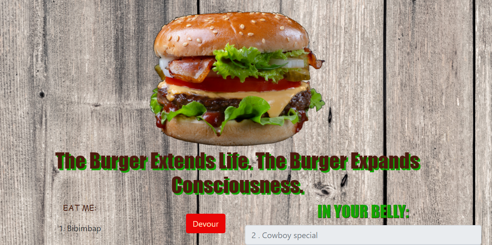

# Eat Da Burger

## Table of Contents
1. [Description](#description)
2. [Deployed Link](#deployed)
3. [Dependencies](#depends)
4. [User Story](#userstory)
5. [Installation](#installation)
6. [How To Use](#usage)
7. [Authors](#author)
8. [Contributions](#contributions)
9. [License](#license)

----------------
## Description

An express app using handlebars to write burgers to a database, then change their status to "Devoured" on the click of a button.

----------------
## Deployed Application
https://sheas-shack.herokuapp.com

----------------
## Dependencies
Node, Express, Express Handlebars, mysql, mysql, sequelize

----------------
## User Story
As a burger connosieur, I want to store a list of burgers I'd like to try, as well as burgers I've devoured, in a database so I can access it whenever I find a burger I like.

----------------
## Installation
1. After downloading this repository, run `npm install` from your terminal window.
2. Create a local mysql database instance.
3. Use sequelize and express to connect the app to your database.

----------------
## Usage
Add burgers you want in the box at the bottom of the page. They will appear in the left side of the page. Click the "Devour" button after you put one in your actual belly. The burger will be moved to your virtual belly on the right side of the page. 

----------------
## Author(s)
s.d.mullaney
View [seagda](https://github.com/seagda) on Github.

----------------
## Contributions

Feel free to download, modify and share to your heart's content. 

----------------
## License
[Creative Commons - CC0](http://creativecommons.org/publicdomain/zero/1.0/)
